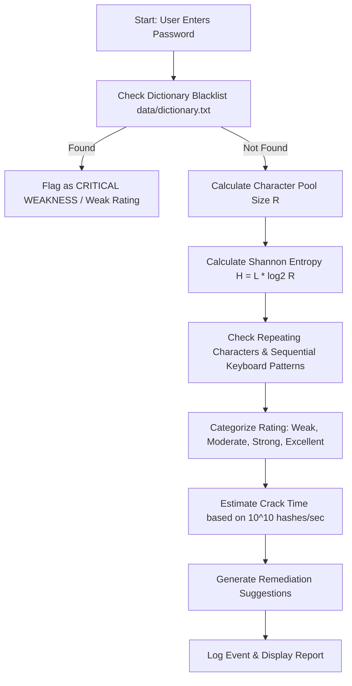
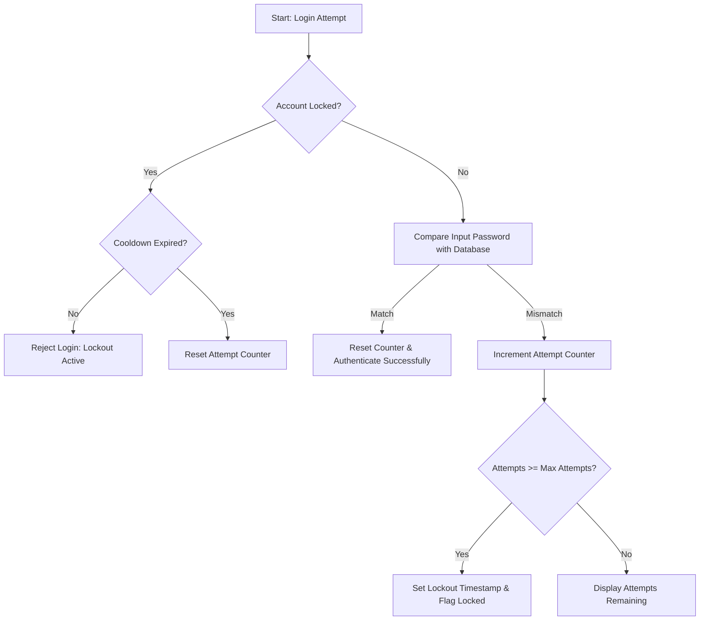
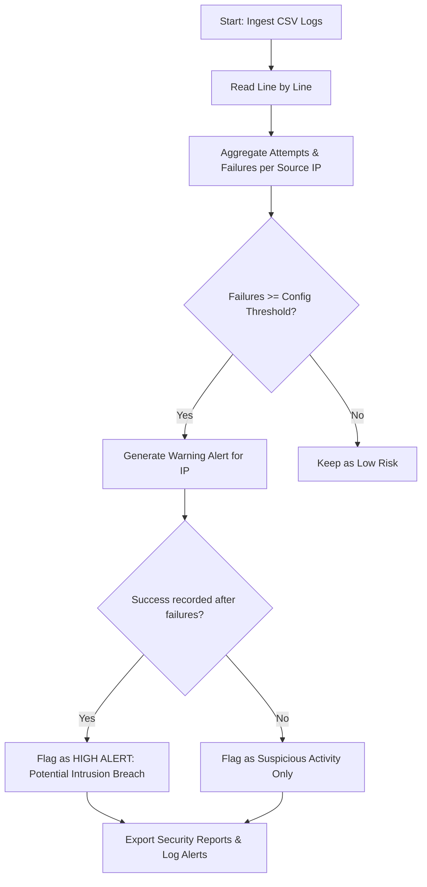

# Toolkit Workflows & Architecture Diagrams

This document contains flowcharts mapping out the logic implemented within the Cybersecurity Authentication Toolkit.

---

## 1. Password Strength Evaluation Flow

---

## 2. Login Lockout & Cooldown Flow

---

## 3. Brute Force IP Detection Flow

